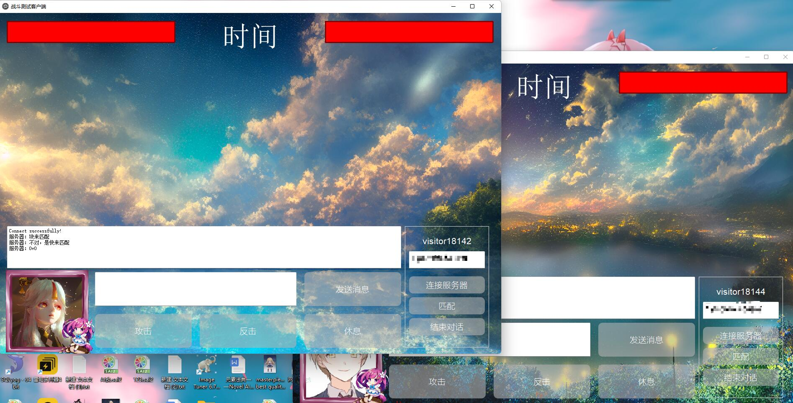
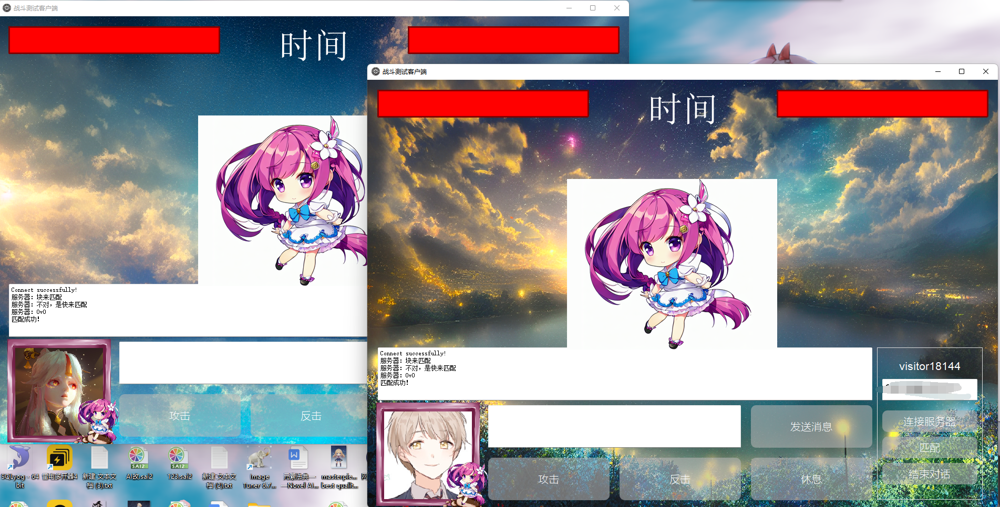
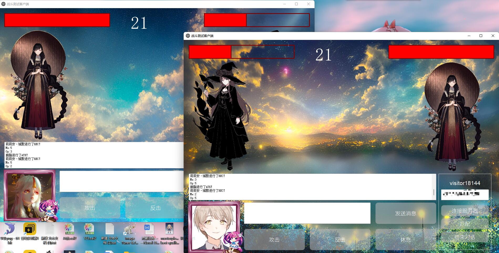
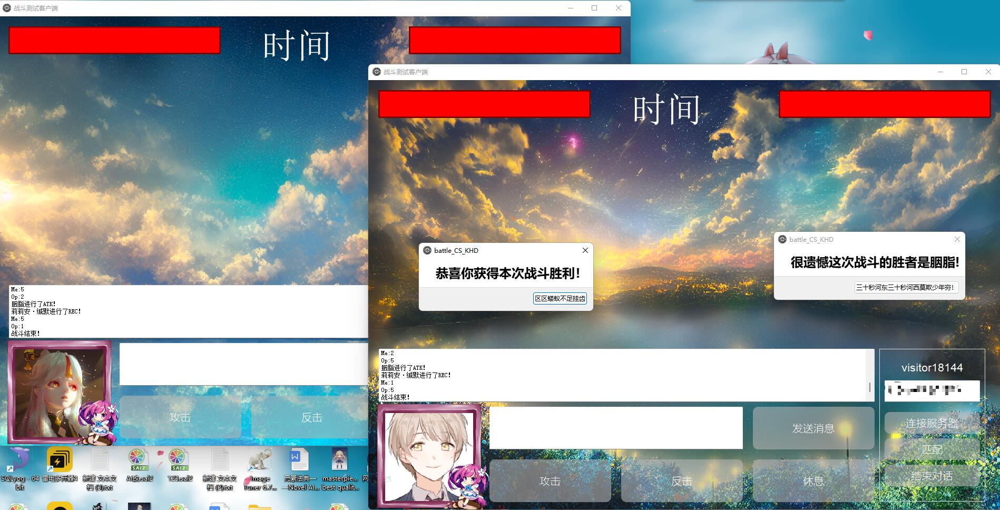

# Mirro_And_Battle
一个基于TCP/IP的练手项目，作为mygalgame的联网对战功能的测试
---

# 相关介绍
---
### 玩法介绍
> 
* 本游戏基于传统的石剪布游戏进行开发，一个回合内玩家有三种策略选择方案：攻击(ATK)、反击(DEF)、休息(REC)、对于对战双方的不同策略，战斗结果有不同的分支。
* P1-ATK,P2-DEF  --P1-(HP -1)
* P1-ATK,P2-ATK  --Nothing happened.
* P1-ATK,P2-REC  --P2-(HP -1)
* P1-DEF,P2-REC  --P2-(HP +1)
* P1-DEF,P2-DEF  --Nothing happened.
* P1-REC,P2-REC  --P1-(HP +1) --P2-(HP +1)
---
### 客户端介绍
 >
 * 等待服务器开始后可用局域网ip连入服务器，服务器会自动分配一个游客ID给客户端，这步骤做完后可以在消息界面给服务器/公频发送消息。
 * 当有两个/以上的客户端接入服务器时，可以使用匹配功能，匹配计时10s，这段时间内若有人一同点击了匹配按钮，则会进入对战房间。
 * 对战时人物是随机分配的，也可以通过修改qrand部分的代码指定图片（人物立绘比例是9：16）。
 * 对战结束时会出现战斗结果的弹窗，点击关闭后恢复匹配前状态。
 
 ---
 
 
 
 
  ---
 ### 服务端介绍
 >
 * 目前服务器端仅做好了功能，ui还没做完，这几天会逐步完善，当界面能看时会进行发布。
 
 ---
 
